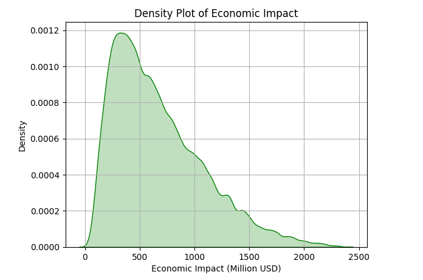
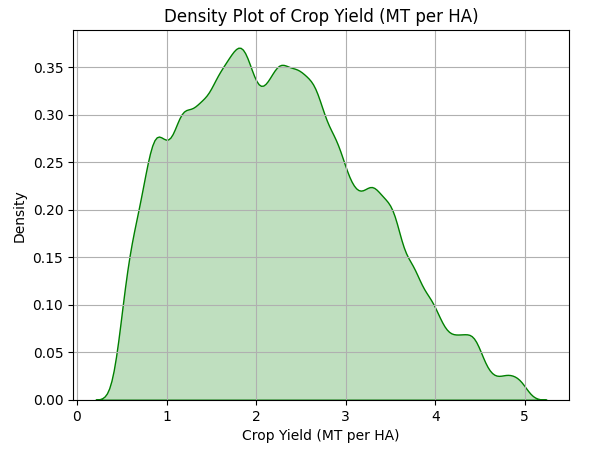
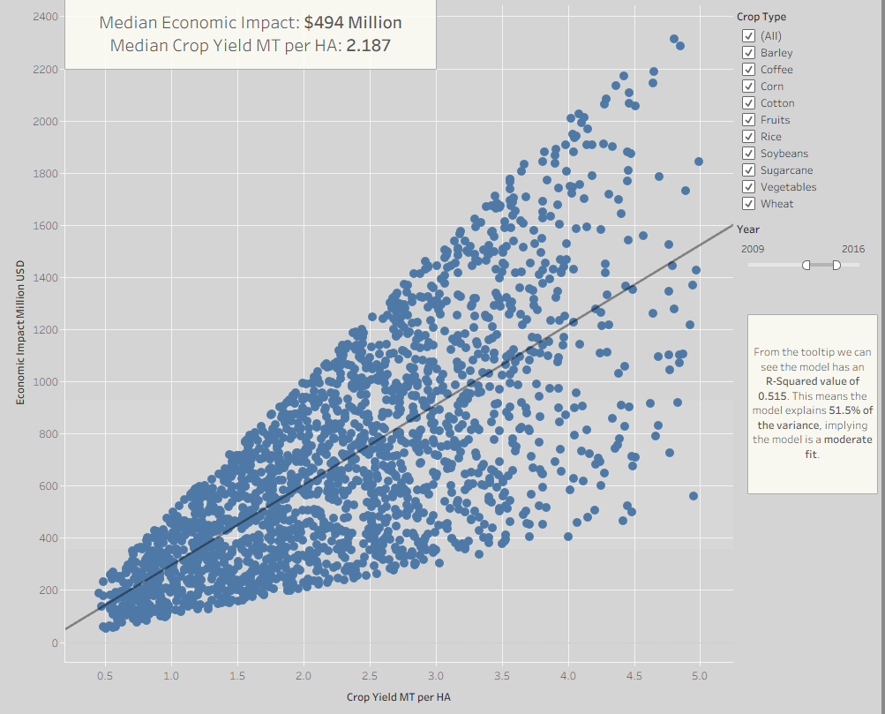
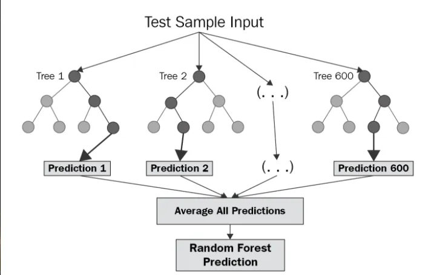
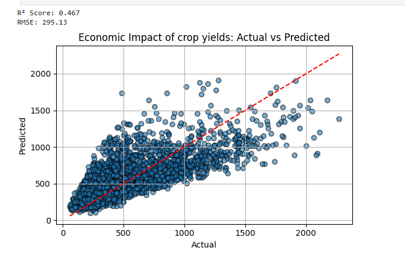
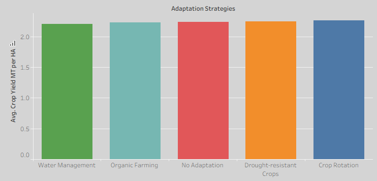
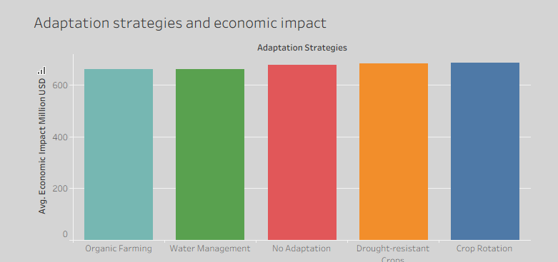
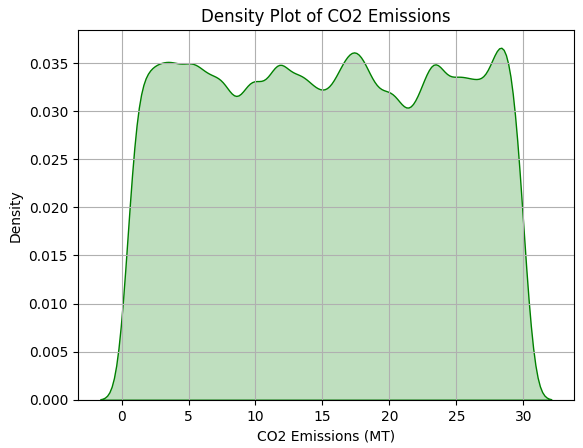
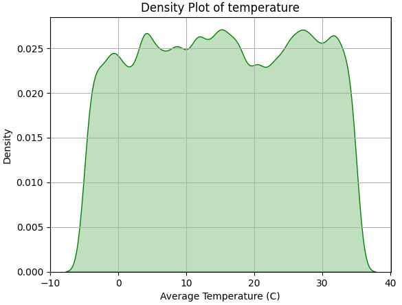
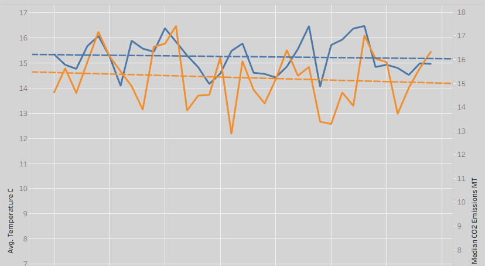

# Impact of Climate Change on Agriculture

**Impact of Climate Change on Agriculture** is a project that seeks to deliver data driven insights to farmers adapting to the ongoing climate crisis.

# 

### Navigation:
* [Data Cleaning](https://github.com/Janeweightman/Climate-Change-Impact-on-Agriculture-/blob/main/jupyter_notebooks/data-cleaning.ipynb)
* [EDA Visualisations in Python](https://github.com/Janeweightman/Climate-Change-Impact-on-Agriculture-/blob/main/jupyter_notebooks/data-visualisations.ipynb)
* [Statistical Analysis](https://github.com/Janeweightman/Climate-Change-Impact-on-Agriculture-/blob/main/jupyter_notebooks/statistical-analysis.ipynb)
* [Tableau Dashboard](https://public.tableau.com/app/profile/jane.weightman/viz/climate-change-agriculture/MainStory?publish=yes)
* [Machine Learning](https://github.com/Janeweightman/Climate-Change-Impact-on-Agriculture-/blob/main/jupyter_notebooks/machinelearning.ipynb)
* [Raw Data](https://github.com/Janeweightman/Climate-Change-Impact-on-Agriculture-/blob/main/data/climate-agriculture.csv)
* [Clean Data](https://github.com/Janeweightman/Climate-Change-Impact-on-Agriculture-/blob/main/data/clean-agriculturedata.csv)

## Dataset Content
* The dataset was found on Kaggle and be found [here](https://www.kaggle.com/datasets/waqi786/climate-change-impact-on-agriculture). The dataset contains 10,000 rows and 15 columns. The dataset includes allows for a wide scope of inquiry, including variables on crop yield, CO2 emissions, extreme weather events and more. 

## Business Requirements
* The business goal of this project is to provide information to farmers, governments and policy makers on how they can best adapt to climate change 
* This is a very important problem to address as according to Christine Li et al in [Nature](https://www.nature.com/articles/s41598-025-87047-y) countries in sub-Saharan Africa, North America, South Asia and Oceania could be at risk of failing to meet national calorie demands by the end of the centuary. 
* We seek to identify trends in the data that can help farmers feed the planet and maximise their profit in a sustainable way. 

## Hypothesis testing 
### H1: Soil Health Drives Economic Productivity
* We hypothesised that soil health would be a major driver behind economic productivity.
* We first tested the distribution of the variables using density distribution plots to determine the appropriate statistical tests to apply. 
#### Distribution for Soil Health:

As you can see the distribution of soil health is not a normal distribution, and infact it has a distinctive uniform distribution, this means it is suitable for non parametric tests. 

#### Distribution for Economic Impact: 

As you can see the distribution is skewed towards lower values meaning it is also suitable for non parametric statistical tests. 
#### Spearman Rank Correlation

We conducted a Spearman Rank Correlation test, the results were decisive with correlation coefficient of -0.009 there is no monotonic relationship and with a P-Value of 0.410 the results were not statistically significant. Thus we have to reject our alternative hypothesis and accept the null hypothesis that soil health does not drive economic impact.

#### Graphing H1: 

As you can see there is no correlation, however if you remember the distribution graphs from perviously you can see that pattern playing out in the above figure. Notice how the triangles become less dense on the Y axis but remain dense on the X axis, this is because soil health is a uniform distribution and economic impact is skewed towards lower values.
### H2: Crop Yields Boost Economic Growth
* We predict that greater crop yields will result in an economic boom
* First we need to check the distribution of crop yields using a density plot
#### Distribution for Crop Yields

Crop yields are not normally distributed making them suitable for non parametric tests.
#### Spearman Rank Correlation

With correlation coefficient of 0.735 and P-value well below 0.05 we can say there there is both a monotonic relationship and that it is highly stastistically significant. Thus we can accept our alternative hypothesis. 
#### Graphing H2

As you can see there is a clear corrrelation and the R Squared value is 0.515 which means that this linear regression explains 51.5% of the economic impact. 
#### Machine Learning model to test H2 
* we used a random forest decision tree to test actual vs predictied values. The model can be found [here](https://github.com/Janeweightman/Climate-Change-Impact-on-Agriculture-/blob/main/jupyter_notebooks/machinelearning.ipynb).

The above figure is from this [article](https://miro.medium.com/v2/resize:fit:720/format:webp/1*ZFuMI_HrI3jt2Wlay73IUQ.png).

We consulted with co-pilot to explain the results to help us tell a story with this ML model. The R squared score means that 46.7% of economic impact can be explained by crop yield alone, which means it's a very significant factor, although less significant than the Tableau linear regression displayed earlier. The RMSE (Root Mean Squared Error) value means that on average the model is $295 million dollars off the actual values. This model is helpful as it shows us how impactful crop yields are to economic growth, furthermore a model like this one or similar could be used to make forecasts for future economic growth.

### H3: Different adaptation strategies have a more positive impact on crop yield
* We pedict the adaptation strategy farmers choose have an impact on overall crop yield.
#### Kruskal-Wallace H test
Since adaptation stategy is a nominal variable Kuskall Wallace was chosen. 

With H-statistic of 3.407 and p-value of of 0.492 we can determine that different adaptation strategies not not have significant impact on crop yields. We therefore have to accept the null hypothesis.

#### Graphing H3:

As you can see there is very little difference between adaptation strategies, even no adaptation is more successful than organic farming or water management. 

### H4: different adaptation strategies have more positive impacts on the economy

* We predict that some of the adaptation strategies farmers choose will have a more positive impact on the economy.

#### Kruskal-Wallace H test:

With an H-statistic of 5.760 and p-value of 0.218 there is no significant impact of adaptation strategies on economy. We there have to accept the null hypothesis. 

#### Graphing H4: 

This is a very similar graph to the previous hypothesis, demonstrating that adaptation strategy does not have an economic impact. 

### H5: CO2 emissions are correlated with temperature
One of the fundamentals of anthropogenic climate change is that man made CO2 emissions are causing a rise in global temperatures. 
* First we need to see the distributions of the variables
#### Distribution of CO2 Emissions

 
The CO2 Emissions have a non normal uniform distribution, making it suitable for non parametric tests 

#### Distribution of Temperature 

Temperature is not normally distributed and has a uniform distribution, sugessting non parametric tests would be suitable. 

#### Spearman Rank Correlation

With a Spearman correlation of 0.004 and p-value of 0.719 we can reject the alternative hypothesis. 

#### Graphing H5 over time
The link between these factors might be more apparent if we plot them across time.

From the graph we can see that there might be some link between the two variables although further analysis would be necessary to be sure. 

## Project Plan
To help plan we used a github project planning board which can be found [here](https://github.com/users/Janeweightman/projects/5).
* Outline the high-level steps taken for the analysis.
* How was the data managed throughout the collection, processing, analysis and interpretation steps?
* Why did you choose the research methodologies you used?

## The rationale to map the business requirements to the Data Visualisations
* List your business requirements and a rationale to map them to the Data Visualisations

## Analysis techniques used
* List the data analysis methods used and explain limitations or alternative approaches.
* How did you structure the data analysis techniques. Justify your response.
* Did the data limit you, and did you use an alternative approach to meet these challenges?
* How did you use generative AI tools to help with ideation, design thinking and code optimisation?

## Ethical considerations
No private data is in this dataset, however there are still ethical considerations. 
There are very view observable trends in the data, including no trends regarding anthropogenic causes of climate change. Readers should not interpret the results of this study to engage in climate change denialism, the data is completely synthetic and does not reflect the very real dangers of climate change.

## Dashboard Design
The dashboard can be found [here](https://public.tableau.com/app/profile/jane.weightman/viz/climate-change-agriculture/MainStory?publish=yes).
### Formatting 
Tableau's story format was used to give an intuitive structure to the dashboard, with questions on each section of the story to add intrigue. The grey colour format was chosen to be easy on the eyes and not draw attention away from the data.

As you can see the dashboard is split into 4 sections, answering 4 different questions.

### Dashboard page 1: 

The first page of the dahsboard answer the question whether soil health has an economic impact. The figure is scatter plot with an added trend line. 
We have added the option to filter by both country and crop type using tick boxes on the right hand side.

### Dashboard page 2:
 
Page 2 answers the question of whether greater crop yields result in an economic boom. The graph is a scatter plot with a trend line, allowing the viewer to see the trend clearly. We have added the option to filter by Crop Type, as well as Year in the form of a slider that allows the user to specify a specific time period for example 2014-2020.

### Dashboard page 3:

Page 3 seeks to answer 2 questions; the first one being whether different adaptation strategies effect crop yield and the second being whether different adaptation strategies have an economic impact. Both questions are answered with bar charts placed one on top of the other for easy comparison. The bar charts are sorted in ascending order and coloured according to adaption method, allowing the viewer to compare the differences between charts, for example the viewer can more easily see that 'Organic Farming' is better than 'Water Management' for crop yields in the first chart.  We have included options to filter by crop type and country on the right hand side, as well as a legend for the adaptation methods. 

### Dashboard page 4: 

Page 4 of the dashboard examines CO2 Emissions and temperature over time, it uses a dual axis line chat with corresponding trend lines. The lines are colour codes with a legend and the chart features filters for country and crop type. 
* **Please note that page 4 does feature a lot of white space beneath the diagram, this is an intentional trade off between aesthetics and functionality as that white space does become occupied if you change the filters.** 

### How the dashboard communicates to technical and non-technical audiences.
A good example of a feature that both informs the technical and non-technical audiences is the trend lines. For a non-technical audience the trend line gives a visual cue to identify trends in data, however for a technical audience it comes with a tooltip that tells you the R squared value and P-value.

#### Filters enable further analysis and engagement through interactivity

### Adding Median to dashboard page 2
We later decided to add more useful information regarding the median values of crop yields and economic impact to the dashboard. We caculated this using median lines in the graph. We use median rather than mean as we know they are no normally distributed.

This did not look aesthetically pleasing, so we took the calculations, removed the lines and added a text box to the story. 

### Adding explanation of R Squared to Dashboard page 2:
we added an explanation of the R-Squared value to page 2 of the dashboard for the benefit of the non technical audience. 

## Unfixed Bugs
* Please mention unfixed bugs and why they were not fixed. This section should include shortcomings of the frameworks or technologies used. Although time can be a significant variable to consider, paucity of time and difficulty understanding implementation are not valid reasons to leave bugs unfixed.
* Did you recognise gaps in your knowledge, and how did you address them?
* If applicable, include evidence of feedback received (from peers or instructors) and how it improved your approach or understanding.

## Development Roadmap
* We had issues with converting year to date/time data type, we decided to keep it as a 64 bit integer, this caused no problems.
* In previous projects we had issues with images not showing when put into a folder, this has been fixed during this project demonstrating growth. 
* There have been a number of times when code did not run, this was fixed with a combination of rubberducking and debugging with Co-Pilot. 
* A major issue was with the dataset itself, the data shows very little trends. When choosing the dataset we read the high usability score and assumed this wouldn't be an issue. In the future when choosing a Kaggle dataset we will make sure to look at the comments and previous projects to ensure you can tell a compelling story. 
* We realised we are heavily reliant on generative AI for building machine learning models, in the future we plan to hone our skills in building ML pipelines with less assistance from AI.
 

## Main Data Analysis Libraries
* **Pandas**: Pandas was used throughout the course as it allows the manipulation of data frames.
* **Matplotlib**: Matplotlib was used to make EDA visualisations.
* **Plotly**: Plotly was used to make EDA visualisations.
* **Seaborn**: Seaborn was used to make EDA visualisations.
* **SciPy** SciPy was used for statistical tests.
* **Scikit-Learn** SkLearn was used for machine learning. 

## Credits 

* In this section, you need to reference where you got your content, media and extra help from. It is common practice to use code from other repositories and tutorials, however, it is important to be very specific about these sources to avoid plagiarism. 
* You can break the credits section up into Content and Media, depending on what you have included in your project. 

### Content 

### Media

- Header image was made using [Canva](https://www.canva.com/)
- Random Forest diagram image can be found [here](https://miro.medium.com/v2/resize:fit:720/format:webp/1*ZFuMI_HrI3jt2Wlay73IUQ.png)

## Acknowledgements
* A special thanks to all the Tutors at Code Institute!
* I would like to thank Kaori from my previous group project who I took inspiration from when building my dashboard.
* A huge thank you to all  my classmates who provided good conversation and support throughout the course.
